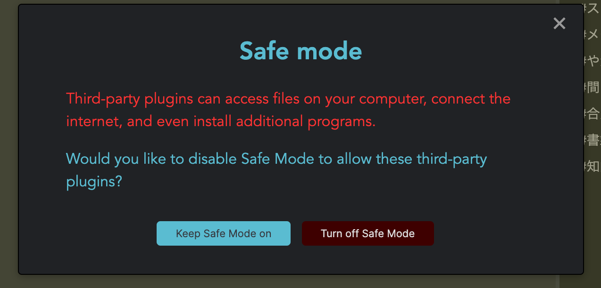

Obsidianは、標準でいくつものプラグインが準備されており、それをオンにすることで新しい機能を追加することができます。

さらに、ユーザー有志が作った特別なプラグインを導入することもできます。

ただし、そのためには[セーフモードを解除する]必要があります。たいていの場合で問題はありませんが、それでも機能の扉を解放することで少しだけ安全性が損なわれることは確かです。言い換えれば、悪意のある第三者が問題のあるプラグインを作ることで、あなたのコンピュータに攻撃を仕掛けられる可能性がゼロではなくなってしまう、ということです。

その点を了承した上で、セーフモードを解除しましょう。

Settingsの「Third-party plugins」の項目にて、Safe modeはオフにできます（標準ではオンになっています）。

サードパーティープラグインは、Safe modeをオフにした後に表示される「Browse」のボタンから閲覧できます。
